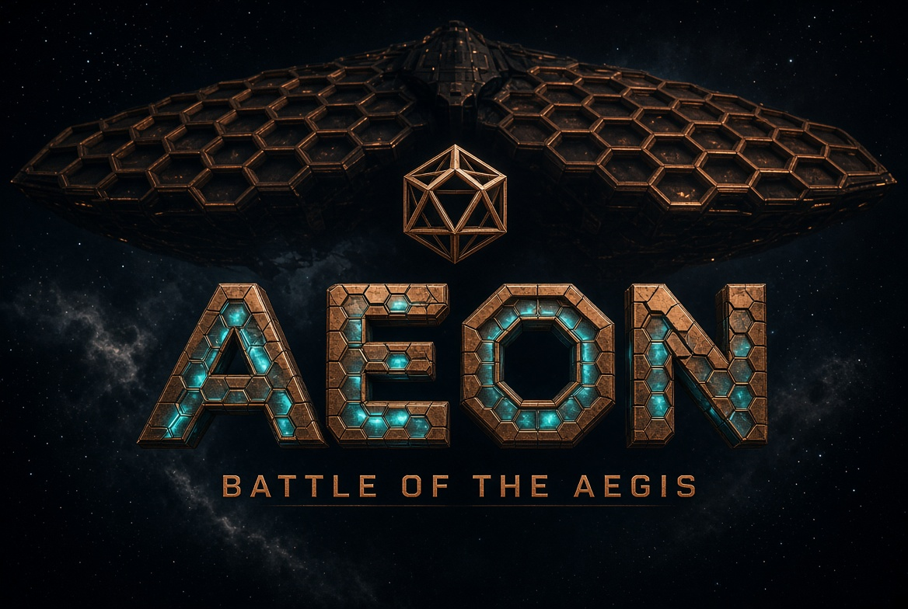

# Aeon

<p align="center">
  
</p>

> **Source available. Not open source.** Copyright © Hedronite LLC. View and contribute welcome under a [CLA](CLA.md); commercial rights reserved. Contributor ≠ core team / profit share. Terms: [EULA.md](EULA.md) (draft).

A classical 1v1 2D fighter in Rust. 

Fast paced footsies, heinous oki pressure, high rewards for strong neutral play. 

Let's build an awesome fighting game in rust!

Want to help with characters and competitive feel? See [CONTRIBUTE.md](CONTRIBUTE.md) (CLA required before merge).

- Law: [DESIGN.md](DESIGN.md). Numbers: [FRAME-DATA.md](docs/FRAME-DATA.md), generated from code and checked by a test. Grading: [QA.md](docs/QA.md).
- Toolchain is pinned to **Rust 1.96.0** by `rust-toolchain.toml`.
- Verified platform: Apple Silicon macOS. Other platforms have not yet been validated.

<p align="center">
  <a href="https://hedronite.com"></a>
  <a href="https://rustup.rs"></a>
  <a href="https://crates.io/crates/aeon-fighter"></a>
  <a href="https://docs.rs/aeon-fighter"></a>
  <a href="EULA.md"></a>
  <a href="docs/ANIMATION-REVIEW.md"></a>
  
</p>

`aeon-fighter` **0.1.0** on crates.io was published under MIT in error. That crate is not relicensed from here. This repository follows the [EULA](EULA.md), not MIT.

## Animation review milestone

All 69 implemented moves and relevant states have recorded visual acceptance. 185 tests, clippy and release pass; sim/frame data unchanged. See [the review guide](docs/ANIMATION-REVIEW.md), [coverage](docs/ANIMATION-COVERAGE.md), [references](docs/ANIMATION-REFERENCES.md) and [audit](docs/ANIMATION-AUDIT.md). Physical stick play and competitive balance follow.

## Get started

Install Rust through rustup and the platform C/linker toolchain, then clone and fetch dependencies once:

```sh
git clone https://github.com/VirtualMachinist/Aeon.git
cd Aeon
cargo fetch --locked
cargo run --release --locked -p aeon
```

On macOS, after dependencies are fetched, double-click `Play-Aeon.command` for subsequent optimized playtests. Its build cache lives outside the source tree. The launcher uses offline mode; a fresh checkout needs the initial fetch above.

## Development commands

```sh
cargo run --release -p aeon     # title → versus / training / remap
cargo run -p aeon -- --smoke     # scripted launch; writes shots/smoke-*.png and exits
cargo test --workspace          # simulation law plus client timing/animation checks
cargo clippy --workspace --all-targets -- -D warnings
```

See [Development guide](docs/DEVELOPMENT.md) for the repository workflow, checks, and full list of preview/capture commands.

## Layout

```text
crates/sim      aeon-fighter: deterministic 60 Hz match. Integer subpixels. Zero dependencies.
                No floats in World, no clock, no filesystem, no renderer (tests/purity.rs).
crates/client   aeon: macroquad + gilrs client. Versus, training, stick remap, replays.
                sequences.rs selects authored reactions/reversals; anim.rs adds motion; fx.rs draws impact.
crates/client/assets/{kogan,raya}/*.png   one keyed 800×800 pose per state
crates/client/assets/animation/*.png     authored walk/attack cells, keyed at load
crates/client/assets/stage/sanctum.png    the Sanctum honeycomb vault
docs/           QA.md (fail-closed rubric), FRAME-DATA.md
tools/keyout.py chroma-keys a generated pose onto the sprite canvas
```

The sim is `World::tick(&mut self, p1: InputFrame, p2: InputFrame)`. Same inputs replay to the same `state_hash()`. That is the contract a later rollback layer (GGRS) consumes; the client is replaceable.

## Controls

Six buttons in a 2×3, the same shape on stick and keyboard:

```
  P     S     HS
  K     FL    ST
```

| | Stick (gilrs, P1) | Keyboard P1 (fallback) | Keyboard P2 |
|---|---|---|---|
| move | left stick / d-pad | `W A S D` | arrows |
| P S HS | West North RT | `Y U I` | `P [ ]` |
| K FL ST | South East RT2 | `H J K` | `L ; '` |

The default pad map is the Street-Fighter-on-Xbox convention. **F8** opens the in-game remap (records raw HID codes, saved to `~/.config/aeon/stick.cfg`). Startup prints every pad gilrs sees and the live map.

Tap up = **hop**, hold up = jump. `66` then hold = **run** (a glide). `44` = backdash. Run immediately stops, blocks, jumps or attacks. Hops add no landing recovery; full jumps add 2f, while committed moves keep their own landing tax.

| Chord | Verb |
|---|---|
| `P+K` | throw (techable, jabbable) |
| `S+FL` | Roman Cancel, 250 |
| `FL+ST` | feint a special's startup |
| `HS+ST` | standing overhead |
| `S+HS` | EX (motion + chord; spends character gauge) |

Specials: `236+S` rekka (press S again for parts 2, 3) · `623+S/HS` uppercut · `63214+FL` command grab · `236+FL` command dash · `214+S` shot A · `236+HS` shot B · `214+HS` Kogan disc / `214+FL` hold Raya consecrate · `236+ST` Kogan falling saber · `j.FL` Kogan air gun · `236236+S` super. The training help panel (`/`) lists both kits with their names.

## Training

`F1` dummy (stand · crouch · block-all · jump · wakeup DP · wakeup P · tech · CPU off) · `F2` boxes (push / hurt / hit, aura outlined separately) · `F3 F4` swap bodies · `F5` reset · `Space` pause · `.` frame-step · `=` fill meter and gauge · `-` heal · `F9` save replay · `R` / `F11` play latest replay · `F12` screenshot. Frame advantage after every exchange is measured from the sim and shown as `ADV`.

## Versus

Character select (any pairing, mirrors included) → best of three rounds, 99 s each → KO / time over / double KO → winner screen → rematch or back to select.

## Out of scope this pass

Netcode, audio, camera effects, other bodies, and anything that puts a float in the sim.

## Status

The current build has 185 passing tests and verified versus/training launches. Both kits are playable and every state of both bodies moves through anticipation, contact and recovery with impact effects. Full-kit animation, stick feel and competitive balance remain ongoing work. Finish Kogan and Raya before expanding the roster.

`aeon-fighter` **0.1.0** remains on crates.io under the MIT metadata it shipped with. That publish was a mistake. This tree is source-available under a draft proprietary [EULA](EULA.md). Hedronite LLC is not yanking that crate from this change.

[Animation prompts](crates/client/assets/animation/PROMPTS.md) preserve the generated-art provenance.

---
_Copyright © Hedronite LLC. Aeon is source-available, not open source. [EULA](EULA.md) · [CLA](CLA.md) · [commercial](COMMERCIAL.md)._
